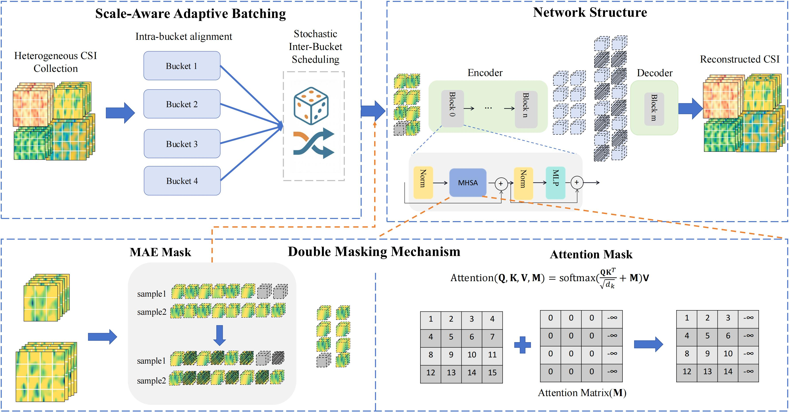

<div align="center">
<h1>HeterCSI: Channel-Adaptive Heterogeneous CSI Pretraining Framework for Generalized Wireless Foundation Models</h1>
</div>

## Abstract
Wireless foundation models promise transformative capabilities for channel state information (CSI) processing across diverse 6G network applications, yet face fundamental challenges due to the inherent dual heterogeneity of CSI across both scale and scenario dimensions. However, current pretraining approaches either constrain inputs to fixed dimensions or isolate training by scale, limiting the generalization and scalability of wireless foundation models. In this paper, we propose \textbf{HeterCSI}, a channel-adaptive pretraining framework that reconciles training efficiency with robust cross-scenario generalization via  a new understanding of gradient dynamics in heterogeneous CSI pretraining. Our key insight reveals that CSI scale heterogeneity primarily causes destructive gradient interference, while scenario diversity actually promotes constructive gradient alignment when properly managed. Specifically, we formulate heterogeneous CSI batch construction as a partitioning optimization problem that minimizes zero-padding overhead while preserving scenario diversity. To solve this, we develop a scale-aware adaptive batching strategy that aligns CSI samples of similar  scales, and design a double-masking mechanism to isolate valid signals from padding artifacts. Extensive experiments on 12 datasets demonstrate that HeterCSI establishes a generalized foundation model without scenario-specific finetuning, achieving superior average performance over full-shot baselines. Compared to the state-of-the-art zero-shot benchmark WiFo, it reduces NMSE by 7.19 dB, 4.08 dB, and 5.27 dB for CSI reconstruction, time-domain, and frequency-domain prediction, respectively.  The proposed HeterCSI framework also reduces training latency by 53\% compared to existing approaches while improving generalization performance by 1.53 dB on average.

## Overview


## Preparation
- Python 3.10 (Recommend to use [Anaconda](https://www.anaconda.com/))
- Install Python dependencies by running:
```shell
pip install -r requirements.txt
```

### Pretrain Dataset
https://huggingface.co/datasets/Chenyu8998/HeterCSI/train

### Zeroshot Dataset
https://huggingface.co/datasets/Chenyu8998/HeterCSI/zeroshot

## Get Started
We have released the pre-trained weights for inference in [[Model](https://huggingface.co/Chenyu8998/HeterCSI)].

### Pretraining
```shell
torchrun --nproc_per_node=2 --master_port=29550 main.py \
--dataset D1,D2,D3,D4,D5,D6,D7,D8 \
--seed 42 \
--batch_size 128 --accum_iter 1 --lr 0.0008 \
--epochs 150 --warmup_epochs 10 --num_workers 16 \
--input_size 48 --patch_size 4 \
--mask_type all \
--mask_ratio 0.5 \
--model mae_vit_csi \
--shuffle_type bucket \ 
--bucket_num 4 \
--data_dir "/home/zhangchenyu/data/csidata/train" \
--output_dir /home/zhangchenyu/experiments/cross_csi/test \
--log_dir /home/zhangchenyu/experiments/cross_csi/test
```

### Test
```shell
python -u test.py \
--dataset D1,D2,D3,D4,D5,D6,D7,D8,D9,D10,D11,D12 \
--seed 42 \
--batch_size 64 \
--num_workers 8 \
--mask_type all \
--mask_ratio 0.5 \
--bucket_num 1 \
--model mae_vit_csi \
--resume "/home/zhangchenyu/experiments/cross_csi/sequential_32dataset_256batch/checkpoint_D32" \
--data_dir "/home/zhangchenyu/data/csidata/generalization" \
--output_dir /home/zhangchenyu/experiments/cross_csi/test_high \
--log_dir /home/zhangchenyu/experiments/cross_csi/test_high
```

## Citation
If you found our project helpful, please kindly cite our paper:
```
@article{zhang2026hetercsi,
      title={HeterCSI: Channel-Adaptive Heterogeneous CSI Pretraining Framework for Generalized Wireless Foundation Models}, 
      author={Chenyu Zhang and Xinchen Lyu and Chenshan Ren and Shuhan Liu and Qimei Cui and Xiaofeng Tao},
      year={2026},
      journal={arXiv preprint arXiv:2601.18200},
}
```